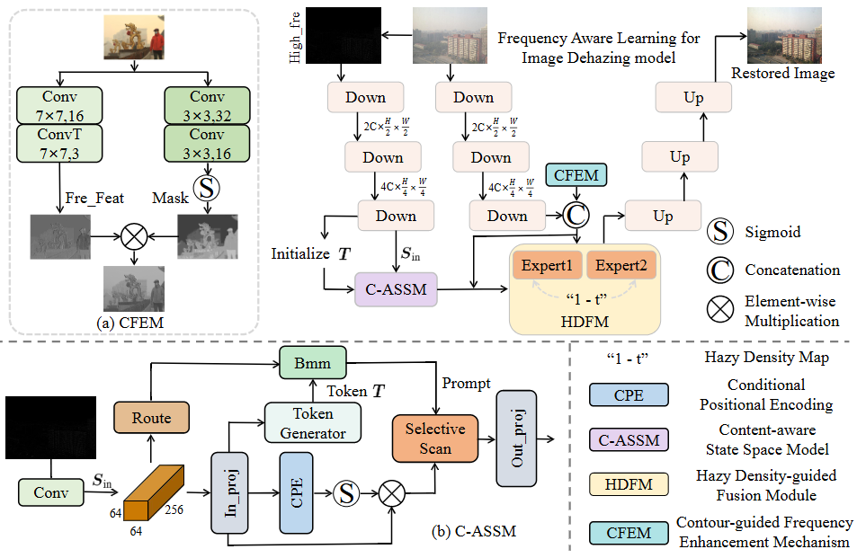

# Unsupervised Real-World Image Dehazing with Frequency Aware Learning🔗

Abstract
===========================
Image dehazing remains a challenging task in real-world scenarios. Unlike synthetic datasets, real-world hazy images often exhibit non-uniform atmospheric degradation, severe haze accumulation, and significant texture loss, making it difficult for existing methods to restore realistic appearance and fine details consistently. To address these challenges, we propose a frequency aware learning based unpaired image dehazing network for real-world hazy scenes. First, we propose a content-aware state space modeling paradigm. It focus details through high-frequency enhancement and incorporates global contextual understanding at the encoding stage, enabling adaptive representation of complex textures. Second, to effectively handle spatially non-uniform degradation, a hazy density estimation module is designed to guide multiple expert-gated feedback units, which dynamically select feature fusion paths. Finally, we propose a contour-guided differentiable frequency domain enhancement mechanism to explicitly recover edge and texture details in degraded regions. Extensive experiments on real-world hazy datasets under unsupervised settings demonstrate that our method achieves competitive performance, validating its effectiveness and strong practical potential under complex atmospheric conditions.



📄 Preparation
===========================
### Clone the repo

```sh
git clone https://github.com/Fan-pixel/FAL-Net.git
cd FAL-Net
```

## 💻 Install
 

### Train

```shell
python train.py -train_batch_size 4 --gpus 0 --type 5
```

### Test

 ```shell
python test.py --gpus 0 --type 5
 ```

#### Results on Outdoor Dehazing Challenge testing images
<div style="text-align: center">

</div>

#### Results on BeDDE and RTTS Dehazing Challenge testing images
<div style="text-align: center">

</div>
